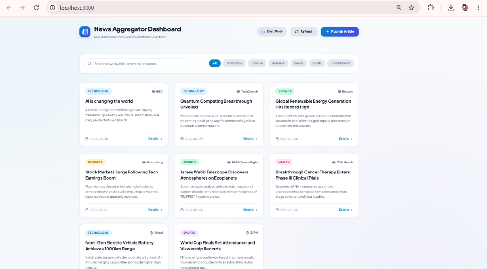
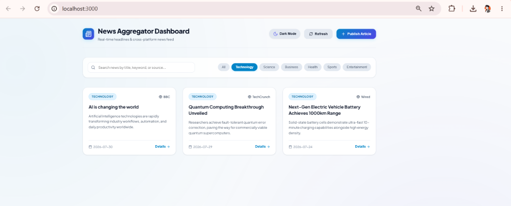
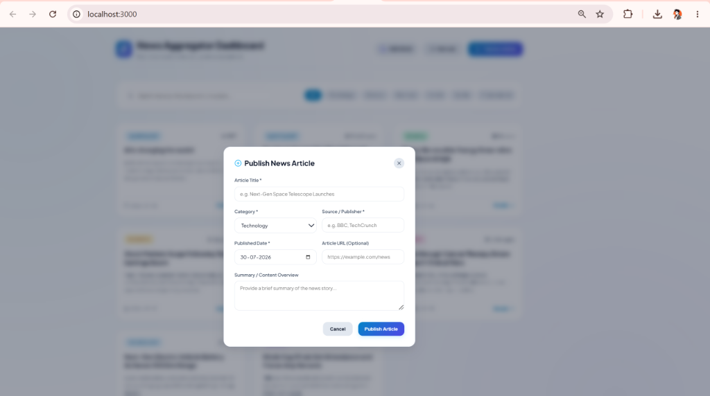

# 📰 News Aggregator Dashboard

A full-stack News Aggregator web application built with **React.js**, **Node.js + Express.js**, **Axios**, **Docker**, and **Docker Compose**. Features a modern UI with dynamic category filtering, search, modal article submission, and interactive **Light/Dark mode**.

---

## 📸 Screenshots

### 1. Main Dashboard View


### 2. Category Filtering (Technology)


### 3. Publish Article Modal Form


---

## ✨ Features

- **Responsive React UI**: Modern card-based dashboard with smooth transitions and theme switching (Light 🌞 / Dark 🌙).
- **RESTful API Backend**: Express server supporting `GET /news`, `GET /news/:id`, and `POST /news`.
- **Search & Category Filters**: Filter news by title, keyword, publisher source, or category pills.
- **Article Publishing**: Publish new articles with custom categories, dates, and summaries via modal dialog.
- **Docker Containerized**: Built with Node 18 Dockerfiles and orchestrated using Docker Compose.
- **1-Click Windows Launcher**: Run instantly using `RUN_APP.bat`.

---

## ⚡ Quick Start Guide

### Option 1: 1-Click Windows Launcher (Recommended)
Double-click **`RUN_APP.bat`** (or run `.\RUN_APP.bat` in terminal). It automatically clears occupied ports, starts backend and frontend services, and opens `http://localhost:3000` in your default browser.

### Option 2: Docker Compose
```bash
docker compose up --build
```
- **Frontend Dashboard**: [http://localhost:3000](http://localhost:3000)
- **Backend REST API**: [http://localhost:5000/news](http://localhost:5000/news)

### Option 3: Local Node.js
```bash
# Terminal 1: Backend
cd backend
npm install && npm start

# Terminal 2: Frontend
cd frontend
npm install && npm start
```

---

## 📁 Project Structure

```text
News-Aggregator/
├── images/                       # Screenshots for README
│   ├── dashboard-home.png
│   ├── category-filter.png
│   └── publish-modal.png
├── frontend/                     # React application
│   ├── src/
│   ├── public/
│   ├── package.json
│   └── Dockerfile
├── backend/                      # Express REST API
│   ├── app.js
│   ├── package.json
│   └── Dockerfile
├── RUN_APP.bat                   # 1-Click launcher script
├── docker-compose.yml            # Multi-container setup (3000 & 5000)
└── README.md                     # Documentation
```

---

## 🔌 REST API Endpoints

- **GET** `/news` — Returns all news articles (supports `?category=` & `?search=`).
- **GET** `/news/:id` — Returns single article details by ID.
- **POST** `/news` — Adds a new article payload to the collection.
